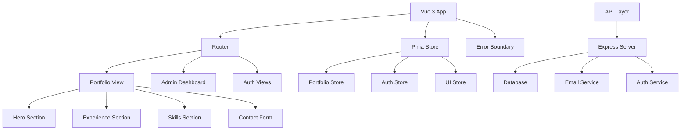

# Design Document

## Overview

This design document outlines the architectural improvements and implementation strategy for transforming the existing Vue 3 + Vuetify portfolio into a production-ready, scalable SaaS platform. The design focuses on modular architecture, performance optimization, enhanced user experience, and robust SaaS capabilities while maintaining the existing visual design and user experience.

The current application suffers from a monolithic App.vue component (1300+ lines), lacks proper error handling, has no loading states, and uses file-based storage. This design addresses these issues through systematic refactoring and feature additions.

## Architecture

### Current Architecture Issues
- **Monolithic Component**: App.vue contains all business logic, data, and presentation
- **No State Management**: All state is local to components
- **File-based Storage**: Uses JSON files instead of proper database
- **No Error Boundaries**: Lacks proper error handling and recovery
- **Missing Loading States**: No feedback during async operations

### Proposed Architecture



### Component Hierarchy Refactoring

**Current Structure:**
```
App.vue (1300+ lines)
├── HeroCard.vue
├── DetailsSection.vue
├── Testimonials.vue
└── UserDetailsForm.vue
```

**Proposed Structure:**
```
App.vue (< 100 lines)
├── layouts/
│   ├── DefaultLayout.vue
│   └── AdminLayout.vue
├── views/
│   ├── PortfolioView.vue
│   ├── AdminDashboard.vue
│   └── AuthView.vue
├── components/
│   ├── portfolio/
│   │   ├── HeroSection.vue
│   │   ├── ExperienceSection.vue
│   │   ├── SkillsSection.vue
│   │   ├── TestimonialsSection.vue
│   │   └── ContactSection.vue
│   ├── admin/
│   │   ├── SubmissionsList.vue
│   │   ├── PortfolioGenerator.vue
│   │   └── UserManagement.vue
│   ├── common/
│   │   ├── LoadingSpinner.vue
│   │   ├── ErrorBoundary.vue
│   │   ├── NotificationToast.vue
│   │   └── ConfirmDialog.vue
│   └── forms/
│       ├── ContactForm.vue
│       ├── LoginForm.vue
│       └── RegistrationForm.vue
```

## Components and Interfaces

### Core Interfaces

```typescript
// User and Portfolio Types
interface User {
  id: string;
  email: string;
  firstName: string;
  lastName: string;
  role: 'user' | 'admin';
  createdAt: Date;
  updatedAt: Date;
}

interface PortfolioRequest {
  id: string;
  userId: string;
  firstName: string;
  lastName: string;
  email: string;
  resumeHeader: string;
  skills: string[];
  status: 'pending' | 'approved' | 'rejected' | 'completed';
  submittedAt: Date;
  processedAt?: Date;
}

interface PortfolioData {
  id: string;
  userId: string;
  personalInfo: PersonalInfo;
  experience: WorkExperience[];
  skills: Skill[];
  education: Education[];
  testimonials: Testimonial[];
  theme: ThemeConfig;
  isPublished: boolean;
}

// API Response Types
interface ApiResponse<T> {
  success: boolean;
  data?: T;
  error?: string;
  message?: string;
}

// UI State Types
interface LoadingState {
  isLoading: boolean;
  message?: string;
}

interface ErrorState {
  hasError: boolean;
  message: string;
  code?: string;
}
```

### Component Specifications

#### 1. Portfolio Components

**HeroSection.vue**
- **Purpose**: Display profile photo, name, title, and key metrics
- **Props**: `profileData: PersonalInfo`, `metrics: Metrics`
- **Features**: Lazy image loading, animated counters, responsive design
- **Size**: < 150 lines

**ExperienceSection.vue**
- **Purpose**: Display work experience in LinkedIn-style cards
- **Props**: `experiences: WorkExperience[]`
- **Features**: Expandable descriptions, company logos, skill chips
- **Size**: < 200 lines

**SkillsSection.vue**
- **Purpose**: Display technical skills with icons
- **Props**: `skills: Skill[]`
- **Features**: Categorized skills, proficiency levels, animations
- **Size**: < 100 lines

#### 2. Admin Components

**AdminDashboard.vue**
- **Purpose**: Main admin interface for managing submissions
- **Features**: Statistics, recent submissions, quick actions
- **Size**: < 200 lines

**SubmissionsList.vue**
- **Purpose**: List and manage portfolio requests
- **Features**: Filtering, sorting, bulk actions, status updates
- **Size**: < 250 lines

**PortfolioGenerator.vue**
- **Purpose**: Generate portfolios from approved requests
- **Features**: Template selection, preview, customization
- **Size**: < 300 lines

#### 3. Common Components

**LoadingSpinner.vue**
- **Purpose**: Reusable loading indicator
- **Props**: `size: string`, `message?: string`
- **Size**: < 50 lines

**ErrorBoundary.vue**
- **Purpose**: Catch and handle component errors
- **Features**: Error logging, fallback UI, retry functionality
- **Size**: < 100 lines

**NotificationToast.vue**
- **Purpose**: Display success/error messages
- **Features**: Auto-dismiss, different types, positioning
- **Size**: < 80 lines

### State Management Architecture

#### Pinia Stores

**Portfolio Store (`stores/portfolio.js`)**
```typescript
interface PortfolioStore {
  // State
  currentPortfolio: PortfolioData | null;
  portfolios: PortfolioData[];
  loading: LoadingState;
  error: ErrorState;
  
  // Actions
  fetchPortfolio(id: string): Promise<void>;
  updatePortfolio(data: Partial<PortfolioData>): Promise<void>;
  createPortfolio(request: PortfolioRequest): Promise<void>;
  deletePortfolio(id: string): Promise<void>;
}
```

**Auth Store (`stores/auth.js`)**
```typescript
interface AuthStore {
  // State
  user: User | null;
  isAuthenticated: boolean;
  loading: boolean;
  
  // Actions
  login(credentials: LoginCredentials): Promise<void>;
  logout(): Promise<void>;
  register(userData: RegisterData): Promise<void>;
  refreshToken(): Promise<void>;
}
```

**UI Store (`stores/ui.js`)**
```typescript
interface UIStore {
  // State
  theme: 'light' | 'dark';
  notifications: Notification[];
  modals: ModalState;
  
  // Actions
  toggleTheme(): void;
  showNotification(notification: Notification): void;
  openModal(modal: ModalConfig): void;
  closeModal(id: string): void;
}
```

## Data Models

### Database Schema

**Users Table**
```sql
CREATE TABLE users (
  id UUID PRIMARY KEY DEFAULT gen_random_uuid(),
  email VARCHAR(255) UNIQUE NOT NULL,
  password_hash VARCHAR(255) NOT NULL,
  first_name VARCHAR(100) NOT NULL,
  last_name VARCHAR(100) NOT NULL,
  role VARCHAR(20) DEFAULT 'user',
  email_verified BOOLEAN DEFAULT false,
  created_at TIMESTAMP DEFAULT CURRENT_TIMESTAMP,
  updated_at TIMESTAMP DEFAULT CURRENT_TIMESTAMP
);
```

**Portfolio Requests Table**
```sql
CREATE TABLE portfolio_requests (
  id UUID PRIMARY KEY DEFAULT gen_random_uuid(),
  user_id UUID REFERENCES users(id),
  first_name VARCHAR(100) NOT NULL,
  last_name VARCHAR(100) NOT NULL,
  email VARCHAR(255) NOT NULL,
  resume_header VARCHAR(200) NOT NULL,
  skills TEXT[] NOT NULL,
  status VARCHAR(20) DEFAULT 'pending',
  submitted_at TIMESTAMP DEFAULT CURRENT_TIMESTAMP,
  processed_at TIMESTAMP,
  processed_by UUID REFERENCES users(id)
);
```

**Portfolios Table**
```sql
CREATE TABLE portfolios (
  id UUID PRIMARY KEY DEFAULT gen_random_uuid(),
  user_id UUID REFERENCES users(id),
  request_id UUID REFERENCES portfolio_requests(id),
  slug VARCHAR(100) UNIQUE NOT NULL,
  data JSONB NOT NULL,
  theme_config JSONB,
  is_published BOOLEAN DEFAULT false,
  created_at TIMESTAMP DEFAULT CURRENT_TIMESTAMP,
  updated_at TIMESTAMP DEFAULT CURRENT_TIMESTAMP
);
```

### API Endpoints Design

**Authentication Endpoints**
```
POST /api/auth/login
POST /api/auth/register
POST /api/auth/logout
POST /api/auth/refresh
GET  /api/auth/profile
```

**Portfolio Request Endpoints**
```
POST /api/requests                 # Submit new request
GET  /api/requests                 # List requests (admin)
GET  /api/requests/:id             # Get specific request
PUT  /api/requests/:id/status      # Update request status
DELETE /api/requests/:id           # Delete request
```

**Portfolio Endpoints**
```
GET  /api/portfolios               # List portfolios
GET  /api/portfolios/:slug         # Get portfolio by slug
POST /api/portfolios               # Create portfolio
PUT  /api/portfolios/:id           # Update portfolio
DELETE /api/portfolios/:id         # Delete portfolio
POST /api/portfolios/:id/publish   # Publish portfolio
```

## Error Handling

### Error Boundary Implementation

```vue
<!-- ErrorBoundary.vue -->
<template>
  <div v-if="hasError" class="error-boundary">
    <v-alert type="error" prominent>
      <v-row align="center">
        <v-col class="grow">
          <div class="title">Something went wrong</div>
          <div>{{ errorMessage }}</div>
        </v-col>
        <v-col class="shrink">
          <v-btn @click="retry">Retry</v-btn>
        </v-col>
      </v-row>
    </v-alert>
  </div>
  <slot v-else />
</template>
```

### API Error Handling Strategy

1. **Network Errors**: Retry with exponential backoff
2. **Validation Errors**: Display field-specific messages
3. **Authentication Errors**: Redirect to login
4. **Server Errors**: Log and show generic message
5. **Rate Limiting**: Show cooldown timer

### Error Logging

```typescript
interface ErrorLog {
  id: string;
  timestamp: Date;
  level: 'error' | 'warning' | 'info';
  message: string;
  stack?: string;
  userId?: string;
  context: Record<string, any>;
}
```

## Testing Strategy

### Unit Testing Approach

**Component Testing**
- Test component rendering with different props
- Test user interactions and events
- Test computed properties and watchers
- Mock external dependencies

**Store Testing**
- Test state mutations
- Test async actions
- Test getters
- Mock API calls

**Utility Testing**
- Test pure functions
- Test validation logic
- Test formatters and helpers

### Integration Testing

**API Integration**
- Test API endpoints with real database
- Test authentication flows
- Test error scenarios
- Test rate limiting

**E2E Testing**
- Test complete user workflows
- Test admin functionality
- Test responsive design
- Test accessibility features

### Testing Tools

- **Unit Tests**: Vitest + Vue Test Utils
- **Component Tests**: @vue/test-utils + Testing Library
- **E2E Tests**: Playwright or Cypress
- **API Tests**: Supertest
- **Coverage**: c8 or Istanbul

### Performance Optimization

#### Code Splitting Strategy

```typescript
// Lazy load admin components
const AdminDashboard = () => import('@/views/AdminDashboard.vue');
const PortfolioGenerator = () => import('@/components/admin/PortfolioGenerator.vue');

// Lazy load heavy libraries
const ChartComponent = () => import('@/components/charts/ChartComponent.vue');
```

#### Image Optimization

```vue
<template>
  
</template>
```

#### Bundle Analysis

- Use Vite Bundle Analyzer
- Implement tree shaking
- Minimize vendor chunks
- Use dynamic imports for routes

## Security Considerations

### Input Validation

```typescript
// Validation schemas using Zod
const portfolioRequestSchema = z.object({
  firstName: z.string().min(1).max(100),
  lastName: z.string().min(1).max(100),
  email: z.string().email(),
  resumeHeader: z.string().min(1).max(200),
  skills: z.array(z.string()).min(1)
});
```

### Authentication & Authorization

- JWT tokens with refresh mechanism
- Role-based access control (RBAC)
- Rate limiting per user/IP
- CSRF protection
- XSS prevention

### Data Protection

- Input sanitization
- SQL injection prevention
- Secure password hashing (bcrypt)
- Environment variable protection
- HTTPS enforcement