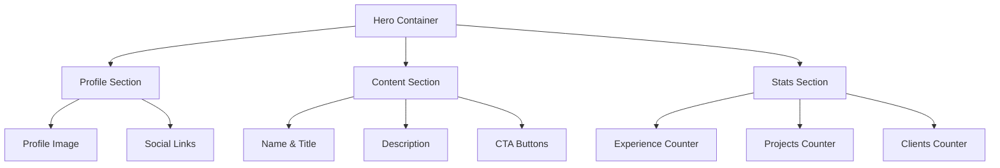

# UI/UX Redesign Design Document

## Overview

This design document outlines the comprehensive UI/UX redesign strategy for transforming the current portfolio from a basic card-based layout into a modern, sophisticated, and visually appealing professional portfolio. The redesign implements a robust design system with multiple themes, improved layouts, enhanced typography, and contemporary visual elements.

The current portfolio suffers from limited visual hierarchy, repetitive card layouts, a restricted color palette, and lacks modern design patterns. This redesign addresses these issues through systematic visual improvements while maintaining excellent usability and performance.

## Design System Architecture

### Color Theme System

#### Theme Structure
```typescript
interface ThemeConfig {
  name: string;
  colors: {
    primary: ColorScale;
    secondary: ColorScale;
    accent: ColorScale;
    neutral: ColorScale;
    semantic: SemanticColors;
    background: BackgroundColors;
  };
  typography: TypographyConfig;
  spacing: SpacingScale;
  shadows: ShadowScale;
  borderRadius: BorderRadiusScale;
}

interface ColorScale {
  50: string;   // Lightest
  100: string;
  200: string;
  300: string;
  400: string;
  500: string;  // Base color
  600: string;
  700: string;
  800: string;
  900: string;  // Darkest
}
```

#### Professional Theme Palettes

**1. Professional Dark Theme**
```css
:root[data-theme="professional-dark"] {
  /* Primary - Deep Navy */
  --color-primary-50: #f0f4f8;
  --color-primary-100: #d9e2ec;
  --color-primary-500: #2d3e50;
  --color-primary-900: #1a252f;
  
  /* Secondary - Teal */
  --color-secondary-50: #f0fdfa;
  --color-secondary-100: #ccfbf1;
  --color-secondary-500: #14b8a6;
  --color-secondary-900: #134e4a;
  
  /* Accent - Amber */
  --color-accent-500: #f59e0b;
  
  /* Background */
  --bg-primary: #ffffff;
  --bg-secondary: #f8fafc;
  --bg-tertiary: #f1f5f9;
}
```

**2. Creative Gradient Theme**
```css
:root[data-theme="creative-gradient"] {
  /* Primary - Purple */
  --color-primary-500: #8b5cf6;
  --color-primary-gradient: linear-gradient(135deg, #8b5cf6 0%, #3b82f6 100%);
  
  /* Secondary - Blue */
  --color-secondary-500: #3b82f6;
  
  /* Accent - Pink */
  --color-accent-500: #ec4899;
  
  /* Background */
  --bg-primary: #ffffff;
  --bg-gradient: linear-gradient(135deg, #667eea 0%, #764ba2 100%);
}
```

**3. Minimal Elegant Theme**
```css
:root[data-theme="minimal-elegant"] {
  /* Primary - Slate */
  --color-primary-500: #475569;
  --color-primary-900: #0f172a;
  
  /* Secondary - Blue */
  --color-secondary-500: #3b82f6;
  
  /* Accent - Red */
  --color-accent-500: #ef4444;
  
  /* Background */
  --bg-primary: #ffffff;
  --bg-secondary: #f8fafc;
}
```

**4. Warm Professional Theme**
```css
:root[data-theme="warm-professional"] {
  /* Primary - Warm Gray */
  --color-primary-500: #78716c;
  --color-primary-900: #292524;
  
  /* Secondary - Orange */
  --color-secondary-500: #ea580c;
  
  /* Accent - Amber */
  --color-accent-500: #d97706;
  
  /* Background */
  --bg-primary: #fefdfb;
  --bg-secondary: #faf7f2;
}
```

### Typography System

#### Font Pairing Strategy
```css
:root {
  /* Primary Font - Headings */
  --font-primary: 'Inter', -apple-system, BlinkMacSystemFont, sans-serif;
  
  /* Secondary Font - Body */
  --font-secondary: 'Inter', -apple-system, BlinkMacSystemFont, sans-serif;
  
  /* Monospace Font - Code */
  --font-mono: 'JetBrains Mono', 'Fira Code', monospace;
}
```

#### Type Scale
```css
:root {
  --text-xs: 0.75rem;    /* 12px */
  --text-sm: 0.875rem;   /* 14px */
  --text-base: 1rem;     /* 16px */
  --text-lg: 1.125rem;   /* 18px */
  --text-xl: 1.25rem;    /* 20px */
  --text-2xl: 1.5rem;    /* 24px */
  --text-3xl: 1.875rem;  /* 30px */
  --text-4xl: 2.25rem;   /* 36px */
  --text-5xl: 3rem;      /* 48px */
  --text-6xl: 3.75rem;   /* 60px */
}
```

### Spacing & Layout System

#### 8px Grid System
```css
:root {
  --space-1: 0.25rem;   /* 4px */
  --space-2: 0.5rem;    /* 8px */
  --space-3: 0.75rem;   /* 12px */
  --space-4: 1rem;      /* 16px */
  --space-5: 1.25rem;   /* 20px */
  --space-6: 1.5rem;    /* 24px */
  --space-8: 2rem;      /* 32px */
  --space-10: 2.5rem;   /* 40px */
  --space-12: 3rem;     /* 48px */
  --space-16: 4rem;     /* 64px */
  --space-20: 5rem;     /* 80px */
  --space-24: 6rem;     /* 96px */
}
```

#### Container System
```css
.container {
  width: 100%;
  max-width: 1200px;
  margin: 0 auto;
  padding: 0 var(--space-4);
}

.container-narrow {
  max-width: 800px;
}

.container-wide {
  max-width: 1400px;
}
```

## Component Design Specifications

### Hero Section Redesign

#### Layout Structure


#### Visual Design
- **Asymmetric Layout**: Profile image on left, content on right with offset alignment
- **Modern Typography**: Large, bold name with gradient text effect
- **Animated Counters**: Smooth number animations with proper accessibility
- **Floating Elements**: Subtle floating animation for profile image
- **Background Treatment**: Subtle gradient or pattern background

### Work Experience Section

#### LinkedIn-Inspired Cards
```vue
<template>
  <div class="experience-card">
    <div class="company-logo">
      
    </div>
    <div class="experience-content">
      <div class="experience-header">
        <h3 class="role-title">{{ experience.role }}</h3>
        <div class="company-info">
          <a :href="experience.companyUrl" class="company-name">
            {{ experience.company }}
          </a>
          <span class="employment-type">{{ experience.type }}</span>
        </div>
        <div class="duration-location">
          <span class="duration">{{ experience.duration }}</span>
          <span class="location">{{ experience.location }}</span>
        </div>
      </div>
      <div class="experience-description">
        {{ experience.description }}
      </div>
      <div class="skills-tags">
        <span v-for="skill in experience.skills" 
              :key="skill" 
              class="skill-tag">
          {{ skill }}
        </span>
      </div>
    </div>
  </div>
</template>
```

#### Visual Enhancements
- **Company Branding**: Prominent company logos with proper sizing
- **Visual Hierarchy**: Clear role/company/duration hierarchy
- **Expandable Content**: Smooth expand/collapse for long descriptions
- **Skill Tags**: Modern chip design with hover effects
- **Timeline Connector**: Optional timeline line connecting experiences

### Skills Section Redesign

#### Categorized Skills Display
```vue
<template>
  <div class="skills-section">
    <div v-for="category in skillCategories" 
         :key="category.name" 
         class="skill-category">
      <h3 class="category-title">{{ category.name }}</h3>
      <div class="skills-grid">
        <div v-for="skill in category.skills" 
             :key="skill.name" 
             class="skill-item">
          <div class="skill-icon">
            <v-icon :name="skill.icon" />
          </div>
          <div class="skill-info">
            <span class="skill-name">{{ skill.name }}</span>
            <div class="skill-level">
              <div class="skill-bar">
                <div class="skill-progress" 
                     :style="{ width: skill.level + '%' }">
                </div>
              </div>
            </div>
          </div>
        </div>
      </div>
    </div>
  </div>
</template>
```

#### Visual Features
- **Skill Categories**: Frontend, Backend, Tools, etc.
- **Proficiency Indicators**: Subtle progress bars or star ratings
- **Icon Integration**: Consistent icon system for technologies
- **Hover Effects**: Smooth hover animations with skill details
- **Grid Layout**: Responsive grid that adapts to content

### Modern Card System

#### Card Variants
```css
/* Base Card */
.card {
  background: var(--bg-primary);
  border-radius: var(--radius-lg);
  box-shadow: var(--shadow-sm);
  padding: var(--space-6);
  transition: all 0.2s ease;
}

/* Elevated Card */
.card--elevated {
  box-shadow: var(--shadow-md);
}

.card--elevated:hover {
  box-shadow: var(--shadow-lg);
  transform: translateY(-2px);
}

/* Gradient Card */
.card--gradient {
  background: var(--bg-gradient);
  color: white;
}

/* Bordered Card */
.card--bordered {
  border: 1px solid var(--color-neutral-200);
  box-shadow: none;
}
```

#### Shadow System
```css
:root {
  --shadow-xs: 0 1px 2px 0 rgba(0, 0, 0, 0.05);
  --shadow-sm: 0 1px 3px 0 rgba(0, 0, 0, 0.1), 0 1px 2px 0 rgba(0, 0, 0, 0.06);
  --shadow-md: 0 4px 6px -1px rgba(0, 0, 0, 0.1), 0 2px 4px -1px rgba(0, 0, 0, 0.06);
  --shadow-lg: 0 10px 15px -3px rgba(0, 0, 0, 0.1), 0 4px 6px -2px rgba(0, 0, 0, 0.05);
  --shadow-xl: 0 20px 25px -5px rgba(0, 0, 0, 0.1), 0 10px 10px -5px rgba(0, 0, 0, 0.04);
}
```

## Layout Patterns

### Grid System Implementation

#### CSS Grid Layout
```css
.layout-grid {
  display: grid;
  grid-template-columns: repeat(12, 1fr);
  gap: var(--space-6);
  margin: var(--space-8) 0;
}

.grid-col-span-6 {
  grid-column: span 6;
}

.grid-col-span-8 {
  grid-column: span 8;
}

.grid-col-span-4 {
  grid-column: span 4;
}

/* Responsive Grid */
@media (max-width: 768px) {
  .layout-grid {
    grid-template-columns: 1fr;
  }
  
  .grid-col-span-6,
  .grid-col-span-8,
  .grid-col-span-4 {
    grid-column: span 1;
  }
}
```

#### Section Layout Variations
1. **Full Width Hero**: Spans entire viewport width
2. **Two Column**: 2/3 content, 1/3 sidebar
3. **Three Column**: Equal width columns for features
4. **Asymmetric**: 1/3 and 2/3 split with offset
5. **Masonry**: Pinterest-style layout for testimonials

### Responsive Design Strategy

#### Breakpoint System
```css
:root {
  --breakpoint-sm: 640px;
  --breakpoint-md: 768px;
  --breakpoint-lg: 1024px;
  --breakpoint-xl: 1280px;
  --breakpoint-2xl: 1536px;
}
```

#### Mobile-First Approach
- Design for mobile first, enhance for larger screens
- Touch-friendly interactive elements (44px minimum)
- Simplified navigation for mobile
- Optimized typography scaling
- Efficient image loading and sizing

## Animation & Interaction Design

### Micro-interactions

#### Hover Effects
```css
.interactive-element {
  transition: all 0.2s cubic-bezier(0.4, 0, 0.2, 1);
}

.interactive-element:hover {
  transform: translateY(-1px);
  box-shadow: var(--shadow-md);
}

.button:hover {
  transform: translateY(-1px);
  box-shadow: 0 4px 12px rgba(0, 0, 0, 0.15);
}

.card:hover {
  transform: translateY(-2px);
  box-shadow: var(--shadow-lg);
}
```

#### Loading States
```vue
<template>
  <div class="skeleton-loader">
    <div class="skeleton-avatar"></div>
    <div class="skeleton-content">
      <div class="skeleton-line skeleton-line--title"></div>
      <div class="skeleton-line skeleton-line--subtitle"></div>
      <div class="skeleton-line skeleton-line--body"></div>
    </div>
  </div>
</template>

<style>
.skeleton-loader {
  animation: pulse 2s cubic-bezier(0.4, 0, 0.6, 1) infinite;
}

@keyframes pulse {
  0%, 100% { opacity: 1; }
  50% { opacity: 0.5; }
}
</style>
```

### Page Transitions
- Smooth scroll behavior
- Staggered section animations
- Parallax effects for hero section
- Smooth theme transitions

## Theme Management System

### Theme Switcher Component
```vue
<template>
  <div class="theme-switcher">
    <button 
      v-for="theme in themes" 
      :key="theme.name"
      @click="setTheme(theme.name)"
      :class="['theme-option', { active: currentTheme === theme.name }]"
      :style="{ backgroundColor: theme.primaryColor }"
    >
      <span class="theme-name">{{ theme.displayName }}</span>
      <div class="theme-preview">
        <div class="preview-primary" :style="{ backgroundColor: theme.primaryColor }"></div>
        <div class="preview-secondary" :style="{ backgroundColor: theme.secondaryColor }"></div>
        <div class="preview-accent" :style="{ backgroundColor: theme.accentColor }"></div>
      </div>
    </button>
  </div>
</template>
```

### Theme Persistence
```typescript
// Theme management store
export const useThemeStore = defineStore('theme', {
  state: () => ({
    currentTheme: 'professional-dark',
    availableThemes: [
      'professional-dark',
      'creative-gradient', 
      'minimal-elegant',
      'warm-professional'
    ]
  }),
  
  actions: {
    setTheme(themeName: string) {
      this.currentTheme = themeName;
      document.documentElement.setAttribute('data-theme', themeName);
      localStorage.setItem('preferred-theme', themeName);
    },
    
    initializeTheme() {
      const saved = localStorage.getItem('preferred-theme');
      const systemDark = window.matchMedia('(prefers-color-scheme: dark)').matches;
      
      if (saved && this.availableThemes.includes(saved)) {
        this.setTheme(saved);
      } else if (systemDark) {
        this.setTheme('professional-dark');
      } else {
        this.setTheme('minimal-elegant');
      }
    }
  }
});
```

## Performance Considerations

### CSS Optimization
- Use CSS custom properties for theme switching
- Minimize layout shifts during theme changes
- Optimize critical CSS for above-the-fold content
- Use CSS containment for isolated components

### Image Optimization
- Responsive images with srcset
- WebP format with fallbacks
- Lazy loading with intersection observer
- Proper aspect ratios to prevent layout shift

### Animation Performance
- Use transform and opacity for animations
- Prefer CSS animations over JavaScript
- Respect prefers-reduced-motion
- Use will-change sparingly

## Accessibility Enhancements

### Color Contrast
- Ensure WCAG AA compliance (4.5:1 ratio)
- Test all theme combinations
- Provide high contrast mode option
- Use color plus other indicators (icons, patterns)

### Keyboard Navigation
- Logical tab order
- Visible focus indicators
- Skip links for main content
- Keyboard shortcuts for theme switching

### Screen Reader Support
- Semantic HTML structure
- Proper heading hierarchy
- ARIA labels for interactive elements
- Live regions for dynamic content updates

This comprehensive design system will transform the portfolio into a modern, professional, and highly customizable platform while maintaining excellent performance and accessibility standards.